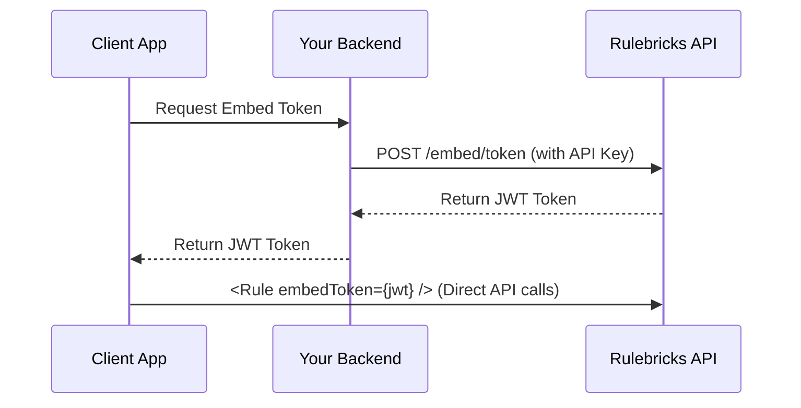

# Core Concepts & Security

Understanding the architecture, permission model, and security best practices is crucial for a production deployment of Rulebricks Embedded.

## Architecture & Token Flow

Rulebricks Embedded uses a **token-based architecture** to ensure your API keys never reach the client.

1.  **Client**: Your app requests access to a rule (e.g., when a user opens the editor).
2.  **Server**: Your backend authenticates the user and uses your **Rulebricks API Key** to generate a short-lived, scoped `embedToken`.
3.  **Rulebricks API**: Validates your key and the user's access, then returns a signed JWT.
4.  **Client**: The `<Rule>` component initializes with this token. All subsequent reads/writes use this token.



## API Keys & Permissions

Permissions in the embed are **inherited** from the API key used to generate the token.

### Hierarchy

- **Organization Admin Key**: Full access to all rules.
- **User Key**: Access only to rules owned by or shared with that specific user.

### Roles & Capabilities

The embed automatically adapts its UI based on the permissions granted:

| Permission      | Effect in Embed                                                                                   |
| :-------------- | :------------------------------------------------------------------------------------------------ |
| **Read-Only**   | User can view rules but cannot edit cells or add rows. Controls are hidden.                       |
| **Editor**      | User can modify values and structure but cannot publish to production.                            |
| **Publisher**   | User can edit and has access to the "Publish" button.                                             |
| **Schema View** | Controls whether users see technical field names (`customer_id`) or descriptions (`Customer ID`). |

**Example**: To give a customer read-only access to their specific rule:

1.  Use an API key associated with a read-only role (or the specific customer's key).
2.  Generate a token for that rule ID.
3.  The embed will render in "Read-Only" mode automatically.

## Security Best Practices

### 1. Never Expose API Keys

**Never** use your Rulebricks API key in client-side code. Always generate tokens on your server.

❌ **Bad:**

```javascript
// Client-side
fetch('https://rulebricks.com/api/embed/token', {
  headers: { 'x-api-key': 'rb_live_...' }, // EXPOSED!
})
```

✅ **Good:**

```javascript
// Server-side
createEmbedToken({ apiKey: process.env.RULEBRICKS_API_KEY, ... })
```

### 2. Token Expiration

Set an appropriate expiration time (`expiresIn`). The default is 1 hour (3600s).

- **Short (15m)**: High security, requires refresh logic.
- **Long (8h)**: Better UX for internal tools.

### 3. Content Security Policy (CSP)

If your app uses CSP, allow connections to Rulebricks:

```html
<meta
  http-equiv="Content-Security-Policy"
  content="connect-src 'self' https://rulebricks.com;"
/>
```


