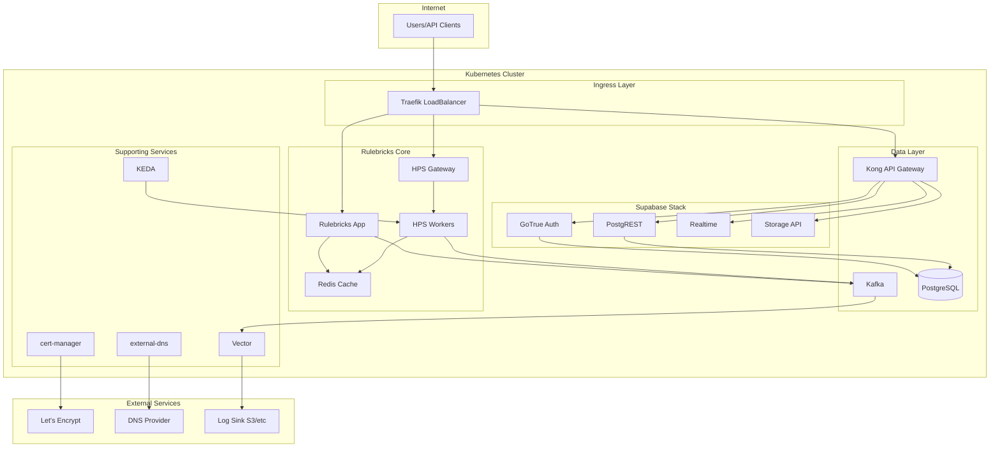
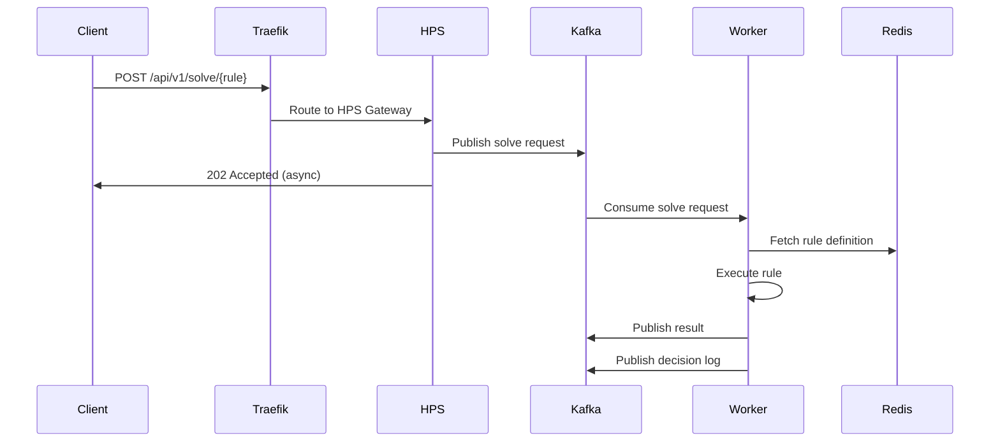
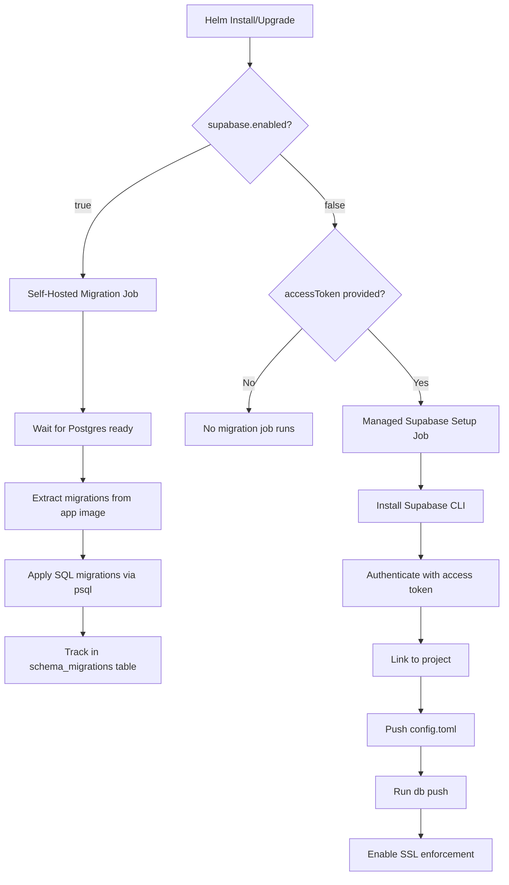
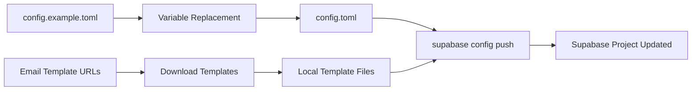
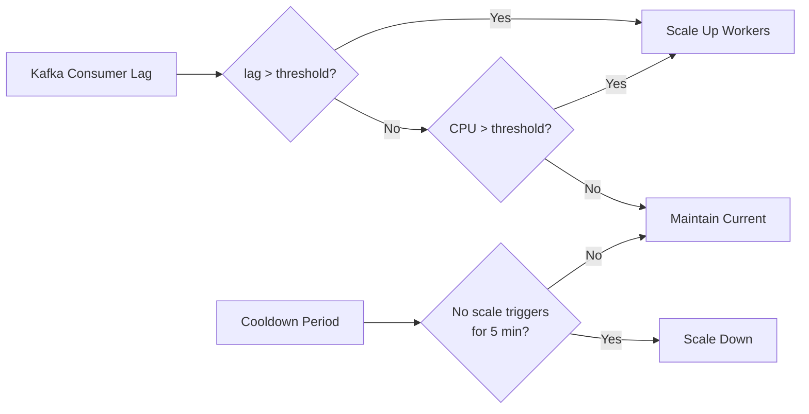

import { Callout } from 'nextra/components'

# Architecture & Operations Guide

This document explains the Rulebricks Helm chart architecture, component interactions, migration flows, and operational considerations, so you can better configure your deployment.

### Component Overview



### Request Flow



### Component Responsibilities

| Component       | Purpose                             | Scaling                         |
| :-------------- | :---------------------------------- | :------------------------------ |
| **Traefik**     | Ingress, TLS termination, routing   | HPA (2-3 replicas default)      |
| **App**         | Web UI, rule editor, management API | Single replica                  |
| **HPS Gateway** | API gateway for rule execution      | Static replicas                 |
| **HPS Workers** | Rule execution engines              | KEDA autoscaling                |
| **Redis**       | Rule cache, session storage         | Single replica with persistence |
| **Kafka**       | Message queue, event streaming      | KRaft mode, single node default |
| **PostgreSQL**  | Persistent data storage             | Single replica with PVC         |
| **Vector**      | Log aggregation and forwarding      | Static replicas                 |

---

## Database Migrations

The chart includes two migration job variants that run automatically based on your configuration.

### Migration Decision Tree



### Self-Hosted Migration Job

**Triggered when:** `supabase.enabled: true`

**Process:**

1. **Init Container** extracts Supabase assets from the Rulebricks app image
2. **Migration Container** uses `postgres:15-alpine` to:
   - Wait for PostgreSQL to be ready
   - Create `schema_migrations` tracking table
   - Apply each `.sql` file in order
   - Record applied migrations to prevent re-runs

**Key Details:**

```yaml
# Job naming pattern
name: {{ .Release.Name }}-db-migrate-{{ .Release.Revision }}

# Runs on
annotations:
  "helm.sh/hook": post-install,post-upgrade
  "helm.sh/hook-delete-policy": before-hook-creation

# Auto-cleanup
spec:
  ttlSecondsAfterFinished: 600  # 10 minutes
```

**Migration Tracking:**

```sql
CREATE TABLE IF NOT EXISTS schema_migrations (
  version VARCHAR(255) PRIMARY KEY,
  applied_at TIMESTAMP DEFAULT NOW()
);
```

Each migration file is tracked by filename. Already-applied migrations are skipped.

### Managed Supabase Setup Job

**Triggered when:** `supabase.enabled: false` AND `global.supabase.accessToken` is provided

**Process:**

1. **Init Container** extracts Supabase project configuration
2. **Setup Container** uses `node:20-alpine` to:
   - Install Supabase CLI
   - Authenticate with your access token
   - Link to your Supabase project
   - Download and configure email templates
   - Push configuration (SMTP, auth settings)
   - Run `supabase db push` to apply schema
   - Enable SSL enforcement

**Configuration Flow:**



**Variables Replaced:**

| Placeholder              | Source                              |
| :----------------------- | :---------------------------------- |
| `env(FULL_URL)`          | `https://{global.domain}`           |
| `env(SMTP_HOST)`         | `global.smtp.host`                  |
| `env(SMTP_PORT)`         | `global.smtp.port`                  |
| `env(SMTP_USER)`         | `global.smtp.user`                  |
| `env(SMTP_PASS)`         | `global.smtp.pass`                  |
| `env(EMAIL_SUBJECTS_*)`  | `global.supabase.emails.subjects.*` |
| `env(EMAIL_TEMPLATES_*)` | Downloaded from URLs                |

### Debugging Migrations

**Self-hosted:**

```bash
# Check job status
kubectl get jobs -n rulebricks -l app.kubernetes.io/component=migrations

# View logs
kubectl logs job/rulebricks-db-migrate-1 -n rulebricks

# Check migration table
kubectl exec -it deploy/rulebricks-supabase-db -n rulebricks -- \
  psql -U postgres -c "SELECT * FROM schema_migrations ORDER BY applied_at;"
```

**Managed Supabase:**

```bash
# Check job status
kubectl get jobs -n rulebricks -l app.kubernetes.io/component=managed-supabase-setup

# View logs
kubectl logs job/rulebricks-managed-supabase-setup-1 -n rulebricks
```

---

## DNS and TLS Setup

### DNS Record Requirements

| Scenario             | Records Needed                  |
| :------------------- | :------------------------------ |
| Self-hosted Supabase | `{domain}`, `supabase.{domain}` |
| Managed Supabase     | `{domain}` only                 |

---

## Scaling Considerations

### Horizontal Scaling

| Component   | Scaling Method | Trigger         |
| :---------- | :------------- | :-------------- |
| Traefik     | HPA            | CPU utilization |
| HPS Workers | KEDA           | Kafka lag, CPU  |
| Vector      | Manual         | Log volume      |

### KEDA Scaling Configuration



---

## Troubleshooting

#### Migration Job Failing

```bash
# Check job status
kubectl get jobs -n rulebricks

# Get detailed error
kubectl describe job rulebricks-db-migrate-1 -n rulebricks

# Check pod logs
kubectl logs job/rulebricks-db-migrate-1 -n rulebricks --all-containers
```

**Common causes:**

- Database not ready (increase readiness wait)
- Invalid credentials
- Network policy blocking access

#### HPS Workers Not Scaling

```bash
# Check KEDA
kubectl get scaledobject -n rulebricks
kubectl describe scaledobject rulebricks-hps-workers -n rulebricks

# Check Kafka metrics
kubectl exec -it rulebricks-kafka-0 -n rulebricks -- \
  kafka-consumer-groups.sh --bootstrap-server localhost:9092 \
  --describe --group hps-workers
```

**Common causes:**

- Kafka consumer group not found
- KEDA unable to reach Kafka
- Incorrect threshold configuration

### Log Collection

```bash
# All pods in namespace
kubectl logs -n rulebricks -l app.kubernetes.io/instance=rulebricks --all-containers

# Specific component with follow
kubectl logs -n rulebricks -l app.kubernetes.io/component=hps-worker -f
```


