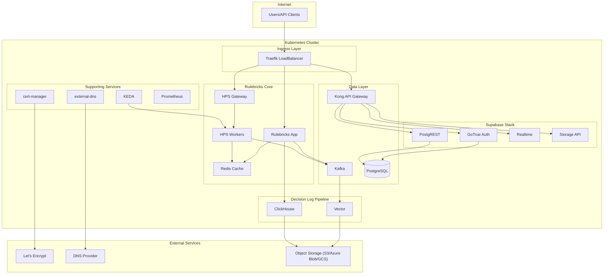
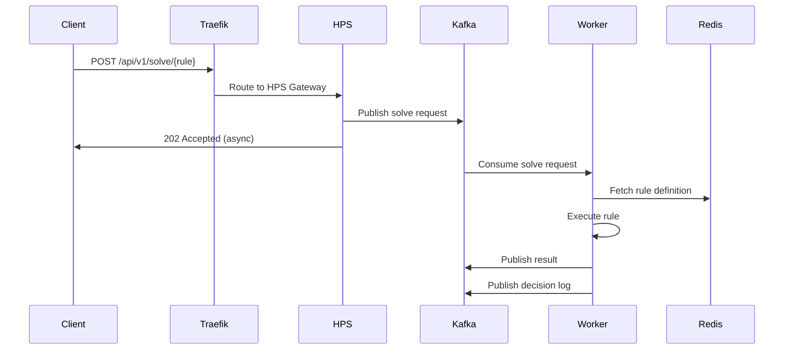
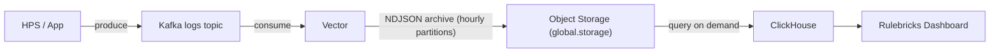
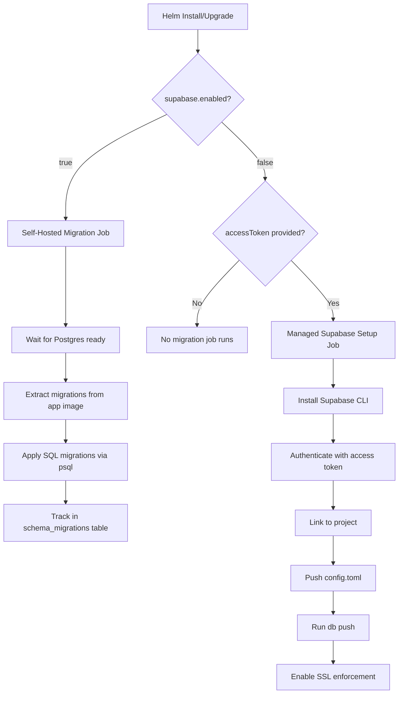

import { Callout } from 'nextra/components'

# Architecture & Operations Guide

This document explains the Rulebricks Helm chart architecture, component interactions, migration flows, and operational considerations, so you can better configure your deployment.

### Component Overview

```mermaid
graph TB
    subgraph Internet
        Users[Users/API Clients]
    end

    subgraph Kubernetes["Kubernetes Cluster"]
        subgraph Ingress["Ingress Layer"]
            Traefik[Traefik LoadBalancer]
        end

        subgraph Core["Rulebricks Core"]
            App[Rulebricks App]
            HPS[HPS Gateway]
            Workers[HPS Workers]
            Redis[Redis Cache]
        end

        subgraph Data["Data Layer"]
            Kafka[Kafka]
            Postgres[(PostgreSQL)]
            Kong[Kong API Gateway]
        end

        subgraph Supabase["Supabase Stack"]
            Auth[GoTrue Auth]
            Rest[PostgREST]
            Realtime[Realtime]
            Storage[Storage API]
        end

        subgraph Logs["Decision Log Pipeline"]
            Vector[Vector]
            ClickHouse[ClickHouse]
        end

        subgraph Support["Supporting Services"]
            CertManager[cert-manager]
            KEDA[KEDA]
            ExternalDNS[external-dns]
            Prometheus[Prometheus]
        end
    end

    subgraph External["External Services"]
        LetsEncrypt[Let's Encrypt]
        DNS[DNS Provider]
        ObjectStorage["Object Storage (S3/Azure Blob/GCS)"]
    end

    Users --> Traefik
    Traefik --> App
    Traefik --> HPS
    Traefik --> Kong

    App --> Redis
    App --> Kafka
    HPS --> Workers
    Workers --> Kafka
    Workers --> Redis

    Kong --> Auth
    Kong --> Rest
    Kong --> Realtime
    Kong --> Storage

    Auth --> Postgres
    Rest --> Postgres

    Kafka --> Vector
    Vector --> ObjectStorage
    ClickHouse --> ObjectStorage
    App --> ClickHouse

    CertManager --> LetsEncrypt
    ExternalDNS --> DNS
    KEDA --> Workers
```

### Request Flow

```mermaid
sequenceDiagram
    participant Client
    participant Traefik
    participant HPS
    participant Kafka
    participant Worker
    participant Redis

    Client->>Traefik: POST /api/v1/solve/{rule}
    Traefik->>HPS: Route to HPS Gateway
    HPS->>Kafka: Publish solve request
    HPS->>Client: 202 Accepted (async)

    Kafka->>Worker: Consume solve request
    Worker->>Redis: Fetch rule definition
    Worker->>Worker: Execute rule
    Worker->>Kafka: Publish result
    Worker->>Kafka: Publish decision log
```

### Component Responsibilities

| Component       | Purpose                                  | Scaling                               |
| :-------------- | :--------------------------------------- | :------------------------------------ |
| **Traefik**     | Ingress, TLS termination, routing        | HPA (2-3 replicas default)            |
| **App**         | Web UI, rule editor, management API      | Single replica                        |
| **HPS Gateway** | API gateway for rule execution           | Static replicas                       |
| **HPS Workers** | Rule execution engines                   | KEDA-scaled Deployment                |
| **Redis**       | Rule cache, session storage              | Single replica with persistence       |
| **Kafka**       | Message queue, event streaming           | KRaft mode, single node default       |
| **PostgreSQL**  | Persistent data storage                  | Single replica with PVC               |
| **Vector**      | Decision log aggregation and forwarding  | Static replicas                       |
| **ClickHouse**  | Decision log queries over object storage | Stateless, single replica default     |
| **Prometheus**  | Metrics collection                       | Single replica, optional remote write |

---

## Decision Log Pipeline

Every rule execution emits a structured decision log. HPS and the app produce entries to the Kafka `logs` topic; Vector archives them to object storage as NDJSON; ClickHouse queries the archive on demand for the dashboard:

```mermaid
flowchart LR
    HPS["HPS / App"] -->|produce| LogsTopic["Kafka logs topic"]
    LogsTopic -->|consume| Vector[Vector]
    Vector -->|"NDJSON archive (hourly partitions)"| Bucket["Object Storage (global.storage)"]
    Bucket -->|query on demand| ClickHouse[ClickHouse]
    ClickHouse --> Dashboard[Rulebricks Dashboard]
```

The full walkthrough, values, and custom sink examples live in [Decision Logs](/private-deployment/decision-logs). Database backups travel to the same bucket under a separate key prefix; see [Storage & Backups](/private-deployment/storage-and-backups).

---

## Database Migrations

The chart includes two migration job variants that run automatically based on your configuration.

### Migration Decision Tree

```mermaid
flowchart TD
    A[Helm Install/Upgrade] --> B{supabase.enabled?}
    B -->|true| C[Self-Hosted Migration Job]
    B -->|false| D{accessToken provided?}
    D -->|Yes| E[Managed Supabase Setup Job]
    D -->|No| F[No migration job runs]

    C --> G[Wait for Postgres ready]
    G --> H[Extract migrations from app image]
    H --> I[Apply SQL migrations via psql]
    I --> J[Track in schema_migrations table]

    E --> K[Install Supabase CLI]
    K --> L[Authenticate with access token]
    L --> M[Link to project]
    M --> N[Push config.toml]
    N --> O[Run db push]
    O --> P[Enable SSL enforcement]
```

### Self-Hosted Migration Job

**Triggered when:** `supabase.enabled: true`

The job extracts SQL migrations from the Rulebricks app image, waits for PostgreSQL to become ready, and applies them in order. Applied migrations are tracked in a `schema_migrations` table so re-runs skip what's already done. Jobs run as Helm post-install/post-upgrade hooks and clean themselves up automatically.

### Managed Supabase Setup Job

**Triggered when:** `supabase.enabled: false` AND `global.supabase.accessToken` is provided

The job authenticates with your access token via the Supabase CLI, links to your project, pushes configuration (domain, SMTP, auth settings, email templates), applies the schema with `supabase db push`, and enables SSL enforcement.

If a migration job fails, see [Troubleshooting](/private-deployment/troubleshooting#migration-jobs) for diagnostics.

---

## DNS and TLS Setup

### DNS Record Requirements

| Scenario             | Records Needed                  |
| :------------------- | :------------------------------ |
| Self-hosted Supabase | `{domain}`, `supabase.{domain}` |
| Managed Supabase     | `{domain}` only                 |

---

## Scaling Considerations

| Component   | Scaling Method | Trigger         |
| :---------- | :------------- | :-------------- |
| Traefik     | HPA            | CPU utilization |
| HPS Workers | KEDA           | Kafka lag, CPU  |
| Vector      | Manual         | Log volume      |

Workers run as a Deployment scaled by KEDA, so scale-out creates pods in parallel and delivers burst capacity in seconds. Worker concurrency is bounded by the partition count of the `solution` Kafka topic; the full sizing model and the values that control it live in [Performance & Scaling](/private-deployment/performance).

For diagnostics across all components, see [Troubleshooting](/private-deployment/troubleshooting).
