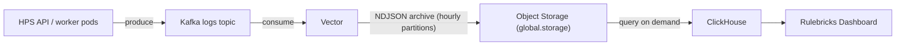

import { Callout } from 'nextra/components'

# Decision Logs

Every rule execution emits a structured decision log. The pipeline that stores and serves these logs is built around your shared object storage bucket.

## How the Pipeline Works



1. HPS API and worker pods produce decision log entries to the Kafka `logs` topic after each request completes (non-blocking, post-response). All solve traffic executes on HPS, so it owns the decision-log producer; the main app does not produce to Kafka.
2. Vector consumes the topic and writes the entries to your bucket under `global.storage.paths.decisionLogs` as compressed NDJSON, partitioned by year/month/day/hour.
3. ClickHouse queries the archive directly for decision logs. When ClickStack is enabled, the same ClickHouse deployment also stores operational telemetry locally, so persistence stays enabled by default.
4. The dashboard's native decision log search runs against ClickHouse. The archive remains plain NDJSON in your bucket, so you can also query it with your own tooling (Athena, DuckDB, and so on) or forward logs to additional sinks.

Bucket configuration and identity are covered in [Storage & Backups](/private-deployment/storage-and-backups).

## Logging Values

| Parameter                                 | Type    | Default             | Description                                                            |
| :---------------------------------------- | :------ | :------------------ | :--------------------------------------------------------------------- |
| `rulebricks.app.logging.enabled`          | boolean | `true`              | Enable decision logging                                                |
| `rulebricks.app.logging.kafkaBrokers`     | string  | `""`                | Kafka brokers (auto-discovered if empty)                               |
| `rulebricks.app.logging.kafkaTopic`       | string  | `"logs"`            | Kafka topic for logs                                                   |
| `rulebricks.app.logging.kafkaTopicPrefix` | string  | `"com.rulebricks."` | Prefix applied to all Kafka topic names; set `""` to disable prefixing |

The topic prefix exists so Rulebricks topics don't collide on shared or managed Kafka clusters (for example, `com.rulebricks.logs`). HPS prepends it to its own topics, and the chart applies it to KEDA lag triggers and the Vector consumer so everything stays in sync. CLI-generated values set it to `""` for in-cluster Kafka, where the broker is dedicated.

If you run your own Kafka cluster, see [External Kafka & Redis](/private-deployment/external-services#vector-and-the-logs-topic) for how Vector connects to it and which ACLs it needs.

## Querying with ClickHouse

Rulebricks deploys ClickHouse to power native decision log querying in the dashboard. Decision log data lives in your bucket; ClickHouse queries that archive through a generated named collection. Local ClickHouse persistence is used for operational telemetry when ClickStack is enabled.

| Parameter                        | Type    | Default        | Description                                                     |
| :------------------------------- | :------ | :------------- | :-------------------------------------------------------------- |
| `clickhouse.enabled`             | boolean | `true`         | Deploy ClickHouse                                               |
| `clickhouse.auth.username`       | string  | `"rulebricks"` | Query user                                                      |
| `clickhouse.persistence.enabled` | boolean | `true`         | Keep local telemetry tables and query metadata across restarts  |
| `clickhouse.persistence.size`    | string  | `"100Gi"`      | Persistent volume size                                          |
| `clickhouse.queryLimits.*`       | object  | see values     | Memory, thread, row-read, and execution time caps               |
| `clickhouse.otelQueryLimits.*`   | object  | see values     | Separate limits for ClickStack telemetry queries                |

ClickHouse reads the archive through a named collection generated from `global.storage.*`, so no separate storage configuration is needed.

## The Archive Sink

When `clickhouse.enabled` is on and `global.storage` is configured, the chart adds a `decision_logs` Vector sink that writes the NDJSON archive to your bucket. The key prefix uses an hourly partition layout (`year=YYYY/month=MM/day=DD/hour=HH/`) that must match what ClickHouse expects to query.

<Callout type="warning">
  The CLI generates this sink automatically; hand-installs should leave the
  generated partition layout intact, or ClickHouse queries will come back empty.
</Callout>

## Forwarding to Other Destinations

Vector can forward decision logs to additional destinations alongside the archive: SIEMs, data lakes, or HTTP endpoints. The chart templates Vector's `kafka` source automatically (brokers, TLS/SASL, and the prefixed log topic come from a generated `vector-kafka-env` ConfigMap), so you only add sinks under `vector.customConfig.sinks`. Use `normalize_logs` as the input to receive the same schema-normalized records the archive sink writes (raw `kafka` also works but skips normalization):

```yaml
vector:
  customConfig:
    sinks:
      # Additional S3 sink example
      s3:
        type: aws_s3
        inputs: [normalize_logs]
        bucket: 'your-logs-bucket'
        region: 'us-east-1'
        key_prefix: 'rulebricks/logs/%Y/%m/%d/'
        compression: gzip
        encoding:
          codec: json
```

See the [Vector sinks documentation](https://vector.dev/docs/reference/configuration/sinks/) for the full catalog of supported destinations.
