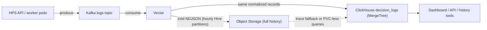

import { Callout } from 'nextra/components'

# Decision Logs

Every rule execution emits a structured decision log. Persistent deployments keep one bounded ClickHouse table for fast application queries and a complete, durable copy in your shared object storage bucket.

## How the Pipeline Works


```mermaid
flowchart LR
    HPS["HPS API / worker pods"] -->|produce| LogsTopic["Kafka logs topic"]
    LogsTopic -->|consume| Vector[Vector]
    Vector -->|"zstd NDJSON (hourly Hive partitions)"| Bucket["Object Storage (full history)"]
    Vector -->|"same normalized records"| ClickHouse["ClickHouse decision_logs (MergeTree)"]
    ClickHouse --> App["Dashboard / API / history tools"]
    Bucket -.->|"trace fallback or PVC-less queries"| ClickHouse
```

1. HPS API and worker pods produce decision log entries to the Kafka `logs` topic after each request completes (non-blocking, post-response). All solve traffic executes on HPS, so it owns the decision-log producer; the main app does not produce to Kafka.
2. Vector consumes and normalizes the topic. With ClickHouse persistence enabled (the default), it writes every normalized record to two destinations: the local `decision_logs` MergeTree table and the object storage archive.
3. Vector writes the archive under `global.storage.paths.decisionLogs` as zstd-compressed NDJSON using `year=YYYY/month=MM/day=DD/hour=HH/` Hive partitions. This is the durable, full-history copy.
4. The dashboard, decision-log API, and in-app history tools query only the MergeTree table during normal operation. They do not combine broad table queries with archive scans.

Flow executions additionally record their execution path. Worker-emitted subflow and parallel records carry a `path_trace` field directly, and top-level flow runs emit companion records with `operation: "flow-trace"` to the same topic. Both store the trace as a compressed JSON string ([compress-json](https://www.npmjs.com/package/compress-json)); the dashboard decompresses it for the read-only execution view and hides `flow-trace` records from log lists. Warehouse queries should expect these companion records and the extra `path_trace` column.

Bucket configuration and identity are covered in [Storage & Backups](/private-deployment/storage-and-backups).

## Logging Values

| Parameter                                 | Type    | Default             | Description                                                            |
| :---------------------------------------- | :------ | :------------------ | :--------------------------------------------------------------------- |
| `rulebricks.app.logging.enabled`          | boolean | `true`              | Enable decision logging                                                |
| `rulebricks.app.logging.kafkaBrokers`     | string  | `""`                | Kafka brokers (auto-discovered if empty)                               |
| `rulebricks.app.logging.kafkaTopic`       | string  | `"logs"`            | Kafka topic for logs                                                   |
| `rulebricks.app.logging.kafkaTopicPrefix` | string  | `"com.rulebricks."` | Prefix applied to all Kafka topic names; set `""` to disable prefixing |

The topic prefix exists so Rulebricks topics don't collide on shared or managed Kafka clusters (for example, `com.rulebricks.logs`). HPS prepends it to its own topics, and the chart applies it to KEDA lag triggers and the Vector consumer so everything stays in sync. CLI-generated values set it to `""` for in-cluster Kafka, where the broker is dedicated.

If you run your own Kafka cluster, see [External Kafka & Redis](/private-deployment/external-services#vector-and-the-logs-topic) for how Vector connects to it and which ACLs it needs.

## Persistent Mode

Persistent mode is the default and recommended production configuration. ClickHouse stores app-facing logs in one MergeTree table with a configurable time-to-live (TTL), while Vector independently preserves every record in the bucket.

- `clickhouse.decisionLogs.retentionDays` controls the table TTL and defaults to 30 days.
- The dashboard, API, and history tools query only this table, so their normal searchable range is the data still present there.
- A disk-pressure safety job may evict the oldest daily table partitions before their TTL when the volume needs merge headroom. It never deletes bucket objects.
- Retention and safety eviction bound local disk use; the bucket remains the complete history for your warehouse and targeted execution-trace recovery.

<Callout type="info">
  Increasing table retention requires enough space under
  `clickhouse.persistence.size`. Object storage retention is managed by your
  bucket lifecycle policy, independently of the ClickHouse TTL.
</Callout>

### Execution Trace Permalinks

An execution trace URL must carry both the execution ID and a `t` timestamp hint:

```text
https://rules.example.com/dashboard/flows/<flow-id>/executions/<flow-execution-id>?t=<unix-epoch-milliseconds>
```

The table serves the link when the record is still retained. If the table lookup misses, the app uses `t` to perform a bounded archive fallback: it reads only the UTC day partitions intersecting the timestamp's ±48-hour window and searches for that execution. This fallback is only for a specific execution permalink; decision-log lists, searches, and history queries do not union the archive into their results.

Keep `t` when copying or storing a permalink. Without a timestamp hint, a link cannot safely locate an execution that has aged out of the table.

Warehouse users can build the same link from each record's `flow_execution_id` and `timestamp`; `flow_id` supplies the route context. Convert `timestamp` to Unix epoch milliseconds for `t`. The flow route corrects itself if the execution belongs to a nested flow.

## PVC-less Mode

Set `clickhouse.persistence.enabled: false` when local persistent storage is unavailable. ClickHouse then runs statelessly and the app queries the raw zstd NDJSON archive through date-scoped object storage reads instead of a local MergeTree table.

Archive queries are deliberately date-bounded: missing ranges receive a bounded default window, and oversized ranges are clamped before ClickHouse reads object storage. This mode avoids a PVC but is expected to be slower, especially for payload search and aggregation. Adding a PVC and enabling `clickhouse.persistence.enabled` is the performance upgrade path.

## Deleted Rules and Flows

Decision logs reference the rule or flow that executed, and private deployments guarantee that reference stays resolvable even after the asset is deleted. Deleting a rule or flow archives a full snapshot of it (every published version plus its final state) instead of purging it.

The log views resolve the live asset first and fall back to the archive only when it is gone:

- **Rule logs** - the matched-rows link opens the decision table as of the version that ran, with the recorded condition highlights, even for deleted rules.
- **Flow executions** - execution permalinks still render the versioned graph with the recorded path overlaid, and the rule inspect modals inside a trace resolve rules that were deleted after the run.

Archived views are read-only and clearly labeled with the asset's deletion date. Archived snapshots live in the application database (not the log archive), are never listed in the dashboard, and are not executable - `/solve` and `/flows` calls against deleted assets fail exactly as before. Assets deleted before upgrading to a version with this feature were purged and cannot be recovered.

<Callout type="info">
  This guarantee is specific to private deployments. On cloud, deleting a rule
  or flow still removes its version history, and log deep links to it stop
  resolving.
</Callout>

## Referenced Vocabulary Values

Every rule decision record carries the materialized vocabulary values used by
the exact rule version that executed. They live inside the existing `decision`
JSON object, so no additional ClickHouse column or Vector transform is
required. The dashboard shows the snapshot under **Referenced Values**, flags
definitions that changed after the run, and links current values to their
history.

The snapshot is bounded to protect Kafka and log-storage throughput:

- payloads up to approximately 1 KiB are stored inline per value;
- the combined structure is capped at approximately 16 KiB; and
- omitted payloads or entries set `referencedValuesTruncated` (normalized to
  `referenced_values_truncated` by the decision-log query API).

Private deployments archive vocabulary rows when they are deleted. The live
catalog row is removed so it cannot be selected or executed, while its final
row and append-only history remain in the application database. Log traceback
first uses the execution-time payload embedded in the log; when that payload
was size-capped, the UI can fall back to the archived final raw value. Access
group checks are enforced on archived lookups exactly as they are for live
values.

As with archived rules and flows, values deleted before installing the
value-history migration cannot be recovered.

## ClickHouse Values

| Parameter                                 | Type    | Default        | Description                                                            |
| :---------------------------------------- | :------ | :------------- | :--------------------------------------------------------------------- |
| `clickhouse.enabled`                      | boolean | `true`         | Deploy the decision-log query service                                  |
| `clickhouse.auth.username`                | string  | `"rulebricks"` | Query user                                                             |
| `clickhouse.decisionLogs.retentionDays`   | integer | `30`           | TTL, in days, for the persistent `decision_logs` MergeTree table       |
| `clickhouse.persistence.enabled`          | boolean | `true`         | Use a PVC and the app-facing MergeTree table                            |
| `clickhouse.persistence.size`             | string  | `"100Gi"`      | Persistent volume size                                                 |
| `clickhouse.persistence.storageClass`     | string  | unset          | StorageClass override; unset uses the cluster default                  |
| `clickhouse.queryLimits.maxMemoryUsage`   | integer | `4294967296`   | Per-query memory cap in bytes                                          |
| `clickhouse.queryLimits.maxThreads`       | integer | `4`            | Per-query thread cap                                                   |
| `clickhouse.queryLimits.maxExecutionTime` | integer | `120`          | Per-query execution cap in seconds                                     |
| `clickhouse.queryLimits.maxRowsToRead`    | integer | `50000000`     | Maximum rows read by one query                                         |
| `clickhouse.queryLimits.readOverflowMode` | string  | `"break"`      | Return rows collected at the read cap; use `throw` to fail instead     |

The archive reader and application table use storage and credentials generated from `global.storage.*`; there is no second storage credential block.

## The Archive Sink

When `clickhouse.enabled` is on and `global.storage` is configured, the chart adds the archive sink. Objects are raw NDJSON compressed with zstd and laid out as:

```text
<global.storage.paths.decisionLogs>/year=YYYY/month=MM/day=DD/hour=HH/*.zst
```

<Callout type="warning">
  The CLI generates this sink automatically; hand-installs should leave the
  generated partition layout and `.zst` suffix intact. PVC-less queries and
  execution-trace fallback prune scans using those date partitions.
</Callout>

## Bring Your Own Warehouse

The bucket is an open NDJSON dataset, so warehouse access does not depend on the app's retention window. For example, DuckDB can read one day from S3 using the ambient AWS credential chain:

```sql
INSTALL httpfs;
LOAD httpfs;
CREATE SECRET (TYPE s3, PROVIDER credential_chain);

SELECT
  timestamp,
  flow_execution_id,
  'https://rules.example.com/dashboard/flows/' || flow_id ||
    '/executions/' || flow_execution_id ||
    '?t=' || CAST(epoch_ms(CAST(timestamp AS TIMESTAMPTZ)) AS VARCHAR)
      AS execution_url
FROM read_ndjson_auto(
  's3://my-rulebricks-data/decision-logs/year=2026/month=07/day=29/hour=*/*.zst',
  hive_partitioning = true
)
WHERE flow_execution_id IS NOT NULL;
```

Replace the bucket and prefix with `global.storage.bucket` and `global.storage.paths.decisionLogs`. Keep day/hour paths in warehouse queries so the object store can prune the scan.

## Forwarding to Other Destinations

Vector can forward decision logs to additional destinations alongside the archive: SIEMs, data lakes, or HTTP endpoints. The chart templates Vector's `kafka` source automatically (brokers, TLS/SASL, and the prefixed log topic come from a generated `vector-kafka-env` ConfigMap), so you only add sinks under `vector.customConfig.sinks`. Use `normalize_logs` as the input to receive the same schema-normalized records the archive sink writes (raw `kafka` also works but skips normalization):

```yaml
vector:
  customConfig:
    sinks:
      # Additional S3 sink example
      s3:
        type: aws_s3
        inputs: [normalize_logs]
        bucket: 'your-logs-bucket'
        region: 'us-east-1'
        key_prefix: 'rulebricks/logs/%Y/%m/%d/'
        compression: gzip
        encoding:
          codec: json
```

See the [Vector sinks documentation](https://vector.dev/docs/reference/configuration/sinks/) for the full catalog of supported destinations.
