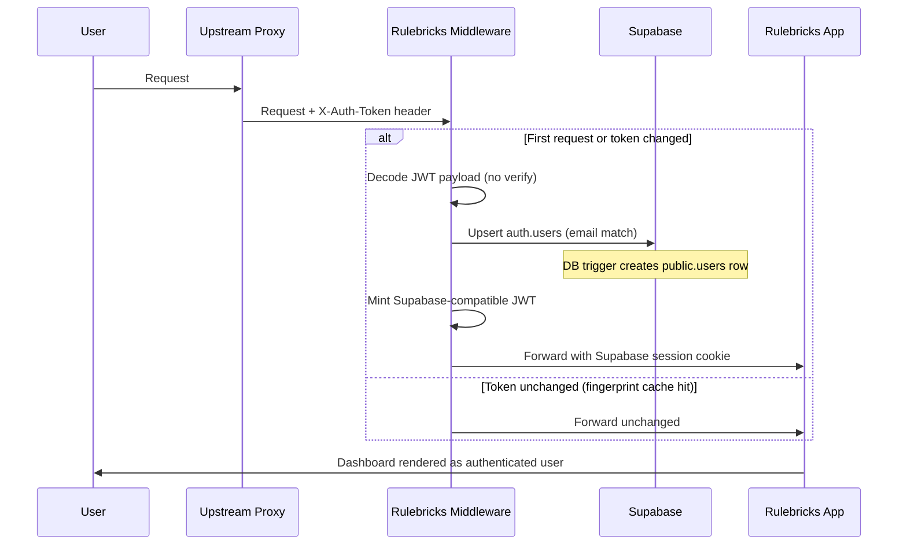

import { Callout } from 'nextra/components'

# External Authentication

This page describes a **token passthrough** authentication mode for self-hosted Rulebricks deployments. Use this mode when Rulebricks lives inside an already-protected network — behind an identity-aware proxy, an internal API gateway, or a service mesh — and you want Rulebricks to trust the JWT that upstream system has already issued as the sole source of user identity, without running any OAuth / OIDC / password flow of its own.

This mode completely disables Rulebricks' own authentication surface: the login UI is hidden, password and magic-link flows are shut off, and identity is derived entirely from the header your proxy attaches to each request.

<Callout type="warning">
  **Never consider this mode** on a public-facing deployment, on a cloud-hosted
  tenant, or anywhere you cannot absolutely guarantee that every request
  reaching Rulebricks has been through your gatekeeper. Rulebricks does **not**
  verify the token signature in this mode – the entire security guarantee rests
  on your upstream proxy.
</Callout>

## How It Works



1. Every request enters our application's middleware.
2. If passthrough is enabled, the middleware extracts the token from a configurable header.
3. On first sight of a token (or a changed token), the middleware:
   - Decodes the JWT payload (base64, no signature verification).
   - Upserts a user in Supabase `auth.users` matched by email.
   - Mints a fresh Supabase-signed JWT (HMAC-SHA256 with your project's JWT secret) with `sub` equal to the Supabase user UUID.
   - Sets the standard Supabase session cookie. All downstream Rulebricks code uses this cookie as if the user had logged in normally.
4. On subsequent requests with the same token, a SHA-256 fingerprint cache short-circuits the work: the middleware returns immediately and the existing session cookie is reused.
5. A user session lasts 24 hours by default. The upstream proxy must continue forwarding a token on every request; otherwise the session cookie alone is enough for the cookie's 24h lifetime, and a new token will trigger re-upsert + re-mint.

## Enabling Passthrough via the Helm Chart

Token passthrough is enabled through a dedicated block in your `values.yaml`. When `global.externalAuth.enabled` is `true`, the chart automatically wires the required flags into the Rulebricks app's ConfigMap and Secret — no manual `env` overrides needed.

A minimal configuration looks like this:

```yaml
global:
  email: 'admin@your-company.com'
  supabase:
    jwtSecret: '<your-supabase-project-jwt-secret>'
  externalAuth:
    enabled: true
    # Optional overrides
    header: 'X-Auth-Token'
    claims:
      email: 'email'
```

<Callout type="info">
  `global.supabase.jwtSecret` and `global.email` are sensitive — prefer sourcing
  them via `global.secrets.secretRef` (External Secrets Operator,
  sealed-secrets, or a manually created Kubernetes Secret) rather than pasting
  them directly into `values.yaml`.
</Callout>

Once these values roll out, the app restarts into passthrough mode: the login UI disappears, the middleware starts reading the configured header on every request, and users provisioned by the upstream proxy flow through to the dashboard transparently.

## Required Chart Values

These three chart values **must** be set when passthrough is enabled. The app refuses to serve any request with a clear 500 if any of the env vars the chart derives from them is missing.

| Chart value                   | Purpose                                                                                                                                                                                                                                                                                                                                          |
| :---------------------------- | :----------------------------------------------------------------------------------------------------------------------------------------------------------------------------------------------------------------------------------------------------------------------------------------------------------------------------------------------- |
| `global.externalAuth.enabled` | Set to `true` to enable the mode. The chart emits both the server flag (`EXTERNAL_AUTH_TOKEN_PASSTHROUGH`) and the matching client flag (`NEXT_PUBLIC_EXTERNAL_AUTH_TOKEN_PASSTHROUGH`) so the browser bundle suppresses login UI and handles session cookies correctly. Any other value (including unset) disables it.                          |
| `global.supabase.jwtSecret`   | Your Supabase project's JWT signing secret. Find it at Supabase Dashboard → Project Settings → API → JWT Settings → "JWT Secret". The middleware signs minted tokens with this, and Supabase validates them with the same secret on every request. Must match exactly. The chart value schema enforces this is non-empty when passthrough is on. |
| `global.email`                | The email address of the administrator. The first user whose token carries this email becomes the workspace admin. All other users are provisioned as child members under that admin. Anchors the "one parent per self-hosted instance" invariant.                                                                                               |

`global.supabase.url` (managed mode) or the derived self-hosted Supabase URL, along with `global.supabase.anonKey` and `global.supabase.serviceKey`, also must be set; they are already required by Rulebricks in any self-hosted configuration, so nothing new there.

## Optional Chart Values

| Chart value                        | Default         | Purpose                                                                                                                                                                                                                                             |
| :--------------------------------- | :-------------- | :-------------------------------------------------------------------------------------------------------------------------------------------------------------------------------------------------------------------------------------------------- |
| `global.externalAuth.header`       | `Authorization` | Header name to read the external JWT from. If `Authorization` (the default), the `Bearer ` prefix is stripped automatically. Use something like `X-Auth-Token` for deployments where the `Authorization` header is already used for something else. |
| `global.externalAuth.claims.id`    | `sub`           | JWT claim path to read as the external stable user identifier. Stored in `user_metadata.external_sub` for reference. Not used for auth — Supabase UUIDs are the real identity.                                                                      |
| `global.externalAuth.claims.email` | `email`         | JWT claim path to read as the user's email. This is the only claim Rulebricks actually uses for user upsert, so it must exist and be unique per user.                                                                                               |
| `global.externalAuth.claims.name`  | `name`          | JWT claim path to read as the user's display name. Copied into `user_metadata.full_name`, which a DB trigger writes to `public.users.name`.                                                                                                         |
| `global.externalAuth.publicPaths`  | `[]`            | YAML list of URL-path prefixes that should NOT require the token. The chart joins them with commas for the app. Useful for public forms (e.g. `['/form/', '/api/form/']`). Requests matching any prefix pass through middleware untouched.          |

## Token Shape

Rulebricks accepts any valid 3-part JWT (`header.payload.signature`). It does not verify the signature — the upstream proxy is responsible for all verification. The algorithm field can be anything (HS256, RS256, ES256, `none`, etc.).

### Required Payload Claim

- `email` (configurable via `global.externalAuth.claims.email`) — The user's email address. Used as the identity key. If the JWT is missing this claim, the middleware returns 401.

### Recommended Payload Claims

- `sub` (configurable via `global.externalAuth.claims.id`) — A stable external identifier such as the IdP's internal user ID. Stored in `user_metadata.external_sub` and `user_metadata.external_claims` on the Supabase auth user for future cross-reference.
- `name` (configurable via `global.externalAuth.claims.name`) — A human-readable display name. Appears on the user's profile in Rulebricks.

### Optional Payload Claims

Any additional claims (e.g. `department`, `role`, `groups`, `cost_center`, `tenant`) are preserved on the auth user (in `user_metadata.external_claims`) and surfaced in the Rulebricks admin SSO-mapping UI. The admin can configure claim-based access / role / tenant / profile mappings from that UI — see [Claim Mapping](/private-deployment/sso/claim-mapping).

### Example Token Payload

```json
{
  "sub": "ext-user-f3a2",
  "email": "alice@acme.com",
  "name": "Alice Lim",
  "department": "engineering",
  "groups": ["developers", "rulebricks-users"],
  "iat": 1712345000
}
```

### Example HTTP Request

```
GET /dashboard HTTP/1.1
Host: rulebricks.internal
X-Auth-Token: eyJhbGciOiJub25lIiwidHlwIjoiSldUIn0.eyJzdWIiOiJleHQtdXNlci1mM2EyIiwiZW1haWwiOiJhbGljZUBhY21lLmNvbSIsIm5hbWUiOiJBbGljZSBMaW0ifQ.
```

Signature bytes can be empty or anything else — they are discarded.

## User Lifecycle

Rulebricks' self-hosted workspace has **exactly one admin user** (the parent). Every other user is a child under that admin. Token passthrough preserves this invariant by anchoring the admin slot to `global.email`.

### Admin Signup

1. Operator sets `global.email: admin@acme.com` in the chart values.
2. The first time ANY passthrough user hits the app (possibly an ordinary user whose email is NOT the admin email), a placeholder admin row with `email = admin@acme.com` and `parent IS NULL` is created inside `sso-provision`.
3. When the actual admin user (someone whose token has `email: admin@acme.com`) signs in, the middleware finds the placeholder row by email, updates its metadata with the claims from their token, and the user takes over the admin slot transparently. No new row is created.
4. The admin then visits **Team → SSO** in the Rulebricks UI to configure claim-based access control and role mappings. Until this is done, all non-admin users default to the `developer` role.

### Regular User Signup

1. A user's browser request arrives at the proxy with no Rulebricks session.
2. The proxy forwards to Rulebricks with the user's JWT in the configured header.
3. Middleware sees no matching session cookie, a new token fingerprint, and upserts the user in `auth.users` keyed by email.
4. Supabase's DB trigger automatically creates matching rows in `public.users`, `public.usage`, and `public.keys`.
5. `/api/sso-provision` runs (invisibly, from the browser after sign-in completes): it finds the admin by `global.email`, sets `public.users.parent` for this user to the admin's UUID, and applies any configured role / tenant / profile mappings from `ssoRoleMapping`.
6. The user lands on `/dashboard`, fully provisioned.

### Sign-Out

There is no traditional sign-out in passthrough mode. If an end user triggers sign-out:

- The browser's Supabase session cookie is cleared.
- On the next request through the proxy, the middleware sees the token again and immediately restores the session (transparent re-login).

This is the expected behavior — in passthrough mode, the proxy owns the session lifetime, not Rulebricks.

## Claim Mapping

Once the admin has logged in, they should visit **Team → SSO** in the Rulebricks UI. This page automatically loads the claim schema from the most recent token and lets the admin configure access, role, tenant, and profile mappings from the same interface used for traditional SSO.

See [Claim Mapping](/private-deployment/sso/claim-mapping) for the full reference on each section.

Mappings are saved to `public.users.ssoRoleMapping` on the admin's row and re-applied on every subsequent user sign-in. Until mappings are configured, every non-admin user is provisioned with the default `developer` role.

<Callout type="info">
  The SSO tab is named "SSO" for historical reasons — the same UI works for
  token passthrough because both use the same claim-based provisioning pipeline.
</Callout>

## Application Behavior Differences

When `global.externalAuth.enabled: true`:

- Routes like `/auth/signin`, `/auth/signup`, `/auth/forgotpass`, and `/auth/changepass` all redirect to `/dashboard`. There is no login UI.
- The top-nav **Sign in** and **Sign up** links are hidden.
- The dashboard-nav **Account** and **Sign out** links are hidden.
- Email / password signup, SSO sign-in, magic links, and password reset are disabled. Calling them does nothing meaningful.
- Supabase auto-token-refresh is disabled in the browser. Token rotation is entirely driven by the middleware's fingerprint cache.
- Public routes listed in `global.externalAuth.publicPaths` bypass the token check. Useful for customer-facing embedded forms.
- `/api/sso-provision` accepts an `identity_claims` body field (the decoded token) so it can apply access / role / tenant / profile mappings without calling an IdP userinfo endpoint.

## RLS and Tenant Isolation

The Rulebricks database has row-level security policies on every user-facing table. These policies use `auth.uid()` — a Supabase function that returns the `sub` claim of the validated JWT.

In passthrough mode:

- The JWT Rulebricks mints always has `sub = <Supabase auth.users UUID>`.
- `public.users.id = auth.users.id` (enforced by the DB trigger).
- So `auth.uid()` returns the correct Supabase UUID, and all existing RLS policies work unchanged.

The external token's `sub` is **never** used for authorization. It is stored as metadata for reference, but identity is always Rulebricks-generated Supabase UUIDs. This means:

- A user's tokens can carry different `sub` values over time (e.g., if the upstream system rotates identifiers) with no impact — emails are the matching key.
- Rulebricks UUIDs remain stable across token rotations.
- RLS policies — including the self-hosted "parent tenant" checks — behave identically to normal deployments.

## Local Testing

The simplest way to try passthrough is with a local Rulebricks chart install pointed at a local Supabase stack.

1. Install the Supabase CLI: `brew install supabase/tap/supabase`.
2. Start a local Supabase instance: `supabase start`. Note the printed `anon key`, `service_role key`, and `JWT secret`.
3. Create a `values-local.yaml` overlay for your chart install:

   ```yaml
   global:
     domain: 'localhost'
     email: 'admin@test.local'
     supabase:
       url: 'http://127.0.0.1:54321'
       anonKey: '<anon key>'
       serviceKey: '<service_role key>'
       jwtSecret: '<JWT secret>'
     externalAuth:
       enabled: true
       header: 'X-Auth-Token'

   supabase:
     enabled: false
   ```

4. Install (or upgrade) the chart with this overlay:

   ```bash
   helm upgrade --install rulebricks oci://ghcr.io/rulebricks/charts/stack \
     --namespace rulebricks --create-namespace \
     -f values-local.yaml
   ```

5. Craft a token. Any of these work:
   - **[jwt.io](https://jwt.io)** — Paste a payload, copy the encoded token, ignore the signature.
   - **Node one-liner**:
     ```bash
     node -e '
     const b64url = s => Buffer.from(s).toString("base64url");
     const payload = { sub: "ext-001", email: "admin@test.local", name: "Test Admin" };
     console.log(`${b64url(`{"alg":"none","typ":"JWT"}`)}.${b64url(JSON.stringify(payload))}.sig`);
     '
     ```
6. Port-forward or ingress to the app service, then hit it:

   ```bash
   TOKEN=<your token>
   curl -i -H "X-Auth-Token: $TOKEN" http://localhost:3000/dashboard
   ```

   First request: expect 200 HTML and Set-Cookie headers. Second request: expect a cache hit (no Set-Cookie).

7. For a full UI walkthrough, use a browser extension like ModHeader to inject the header on every request, then navigate to the Rulebricks UI.

<Callout type="warning">
  Do not test passthrough against a shared production database. The passthrough
  mode rewrites users and session cookies on every cold start; running it
  against a multi-tenant production dataset can corrupt existing tenants. Use a
  local Supabase or a dedicated staging project.
</Callout>

## Security Model

Passthrough mode is **explicitly trust-based**. Rulebricks does not verify the token signature against an IdP, does not validate the issuer, and does not check expiry or audience claims in any cryptographic sense. The entire security guarantee rests on:

1. The upstream proxy authenticating and verifying the token before forwarding.
2. The proxy **never** forwarding a token it did not issue itself or fully vet.
3. The network between the proxy and Rulebricks being a private network that nothing else can reach.
4. The operator setting `global.email` to an email only the real admin controls.

If any of those assumptions breaks, an attacker who can inject HTTP headers reaching Rulebricks can impersonate any user (including the admin) simply by crafting a JSON payload.

This is the intended trust model for the internal-network deployment scenario this feature is designed for. Deployments that cannot meet these assumptions should use the standard OIDC SSO mode instead — see the [SSO Overview](/private-deployment/sso) for configuration.

## Troubleshooting

**Every request returns 500 "Token passthrough is enabled but required env vars are missing: …"**
Confirm that `global.externalAuth.enabled`, `global.supabase.jwtSecret`, and `global.email` are all set in your chart values, then redeploy. The chart's value schema also enforces `global.supabase.jwtSecret` is non-empty whenever passthrough is enabled, so a missing secret should fail at `helm install` time rather than at runtime.

**Every request returns 401 "Missing authentication token"**
The header configured at `global.externalAuth.header` is not present on the incoming request. Verify the upstream proxy is adding the header and that its name matches exactly (case-insensitive, but the `Bearer ` prefix stripping only applies when the value is left at the default `Authorization`).

**401 "Token missing required email claim"**
The token decodes but has no value at `global.externalAuth.claims.email` (default `email`). Adjust the claim path or update the proxy to include the email.

**401 "Invalid token format"**
The header value is not a 3-part dot-separated JWT. Check for trailing whitespace or truncation in the proxy.

**User reaches `/dashboard` but sees no data, and `supabase.auth.getUser()` returns a user**
Likely cause: `global.supabase.jwtSecret` does not match the Supabase project's JWT secret. Fix by copying the secret from Supabase Dashboard → Project Settings → API → JWT Settings into your chart values, then redeploy.

**Admin user sees "SSO provisioning is not yet active" banner**
Expected state until the admin configures role mappings. Go to **Team → SSO**, pick a role claim (e.g. `groups`), add mappings, and save.

**Non-admin users keep landing at `/auth/denied`**
The `accessMapping` rule in the admin's SSO configuration is rejecting their token. Verify the configured `claimPath` exists on the token and that its value is in the allowed list.

**Two "parent" users appear in the database**
Should never happen if the workflow above is followed. If it does, it means `global.email` was unset or changed between deploys. Fix: manually re-point the orphaned rows to a single parent via SQL, or contact support.
