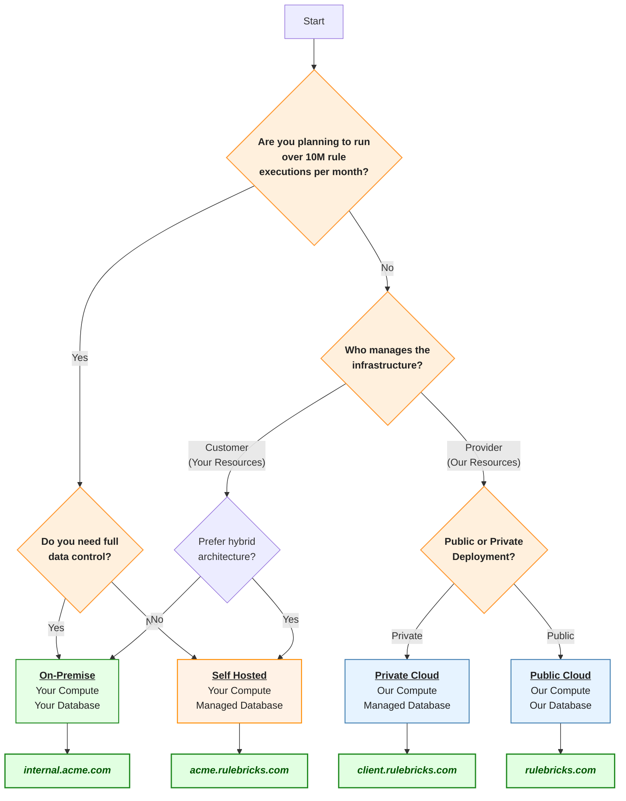

Before you get started deploying privately, you should understand the different deployment options available to you. We've made this simple chart to help you decide which option is best for your needs.

## Deployment Options

We support all four of these combinations, and provide a self-serve CLI experience to set up any one of these within 30 minutes. This CLI automates both provisioning infrastructure and installing Rulebricks.

## ✉️  Request Access

Rulebricks offers straightforward Kubernetes based deployment via Terraform on **AWS**, **GCP**, and **Azure**, allowing for deployments in sensitive, even airgapped environments, or for deployments where it’s important to co-locate the rule engine with backend resources to achieve particularly low latencies.

A few AI and logging features are require extra configuration in private environments, since third party services are used for these. Absolutely everything else– including the database and authentication infrastructure, can be self-hosted.

To gain access to our private cloud offerings, schedule a demo with us, or ping us at `support@rulebricks.com` , describing your use-case for Rulebricks and your preferred cloud provider.

We are happy to provide a totally free private envonment for you to evaluate Rulebricks in your own environment, scheduling a production deployment check-in for after you've had a chance to properly evaluate the software.
