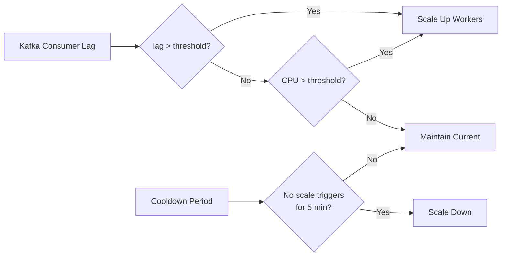

import { Callout } from 'nextra/components'

# Performance & Scaling

Rule execution capacity is determined by the HPS worker fleet. This page explains the sizing model and the values that control it.

If you deploy with the [Rulebricks CLI](/private-deployment/cli), these values are generated from the chart's baseline defaults and autoscale with load. Tune them by hand (or pick larger node instance types) when you need more sustained throughput.

## The Sizing Model

Workers are single-threaded processes doing CPU-bound rule evaluation. Three ideas hold the model together:

1. **Partitions are the concurrency ceiling.** The `solution` Kafka topic's partition count (`rulebricks.hps.workers.solutionPartitions`) is the maximum number of workers that can consume in parallel. It is a ceiling, not a worker quota: idle partitions are effectively free, so the defaults carry roughly 2x headroom over the maximum worker count, because partition counts can be raised but never lowered.
2. **Workers scale out, not up.** Each worker gets one full CPU core with request equal to limit, which avoids CFS throttling mid-batch. Adding replicas adds capacity; raising per-pod resources does not.
3. **KEDA scales on backlog.** Workers run as a Deployment scaled by KEDA on Kafka consumer lag, so scale-out creates pods in parallel and delivers burst capacity in seconds.

Two rules must always hold:

- `keda.maxReplicaCount` must stay at or below `solutionPartitions`; a worker beyond the partition count would sit idle.
- `solutionPartitions` must match the partition count of the actual `solution` topic, whether provisioned by the chart (`kafka.provisioning`) or pre-created on an [external Kafka cluster](/private-deployment/external-services#topics-to-pre-create).

The CLI validates both rules before anything reaches your cluster.

## Worker Values

| Parameter                                   | Type    | Default                      | Description                                           |
| :------------------------------------------ | :------ | :--------------------------- | :---------------------------------------------------- |
| `rulebricks.hps.replicas`                   | integer | `3`                          | HPS gateway replicas                                  |
| `rulebricks.hps.workers.replicas`           | integer | `4`                          | Base worker replica count                             |
| `rulebricks.hps.workers.solutionPartitions` | integer | `64`                         | Partition count of the `solution` topic (the ceiling) |
| `rulebricks.hps.workers.resources.*`        | object  | 1 CPU / 1Gi, request = limit | Per-worker resources; keep request equal to limit     |

## KEDA Autoscaling

| Parameter                                     | Type    | Default | Description                    |
| :-------------------------------------------- | :------ | :------ | :----------------------------- |
| `rulebricks.hps.workers.keda.enabled`         | boolean | `true`  | Enable KEDA autoscaling        |
| `rulebricks.hps.workers.keda.minReplicaCount` | integer | `4`     | Minimum workers                |
| `rulebricks.hps.workers.keda.maxReplicaCount` | integer | `48`    | Maximum workers                |
| `rulebricks.hps.workers.keda.pollingInterval` | integer | `10`    | Seconds between metric checks  |
| `rulebricks.hps.workers.keda.cooldownPeriod`  | integer | `300`   | Seconds before scale-down      |
| `rulebricks.hps.workers.keda.lagThreshold`    | integer | `100`   | Kafka lag threshold (messages) |
| `rulebricks.hps.workers.keda.cpuThreshold`    | integer | `25`    | CPU percentage backup trigger  |

Lag is measured in messages. HPS splits bulk requests into bounded chunks, so each message represents roughly 50 to 150ms of work, and the default threshold of 100 approximates 10 to 15 seconds of backlog for a single worker.



## Scaling Beyond the Defaults

```yaml
# Higher-throughput configuration
# (update kafka.provisioning topic partitions to match solutionPartitions)
# Your node-pool should have enough capacity to support the maximum number of workers
rulebricks:
  hps:
    replicas: 4
    workers:
      solutionPartitions: 96
      keda:
        minReplicaCount: 12
        maxReplicaCount: 96
```

<Callout type="warning">
  When raising `solutionPartitions`, the `solution` and `solution-response`
  topics must grow with it. In-cluster installs converge automatically on
  upgrade via the chart's topic provisioning; on external Kafka you raise the
  partition counts yourself.
</Callout>

## Other Scaling Surfaces

| Component   | Scaling Method | Trigger         |
| :---------- | :------------- | :-------------- |
| Traefik     | HPA            | CPU utilization |
| HPS Workers | KEDA           | Kafka lag, CPU  |
| Vector      | Manual         | Log volume      |

Throughput also depends on how clients call the solve API: bulk payloads amortize network cost, and the [request size limits](/private-deployment/external-services#request-size-limits) describe the byte-first admission model.

To verify a deployment under load, use the [benchmarking toolkit](https://github.com/rulebricks/helm/tree/main/benchmarks) in the helm repository.
