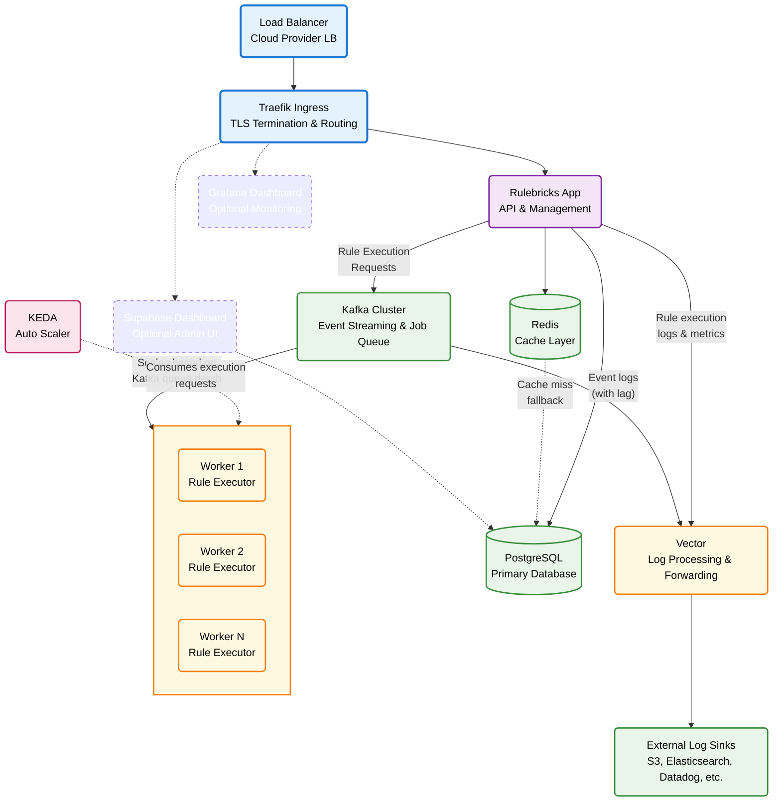

import { Callout } from 'nextra/components'


Our unified Helm chart deploys Rulebricks and all its dependencies to your Kubernetes cluster in a single command. You'll need:

- **Kubernetes 1.19+** (EKS, GKE, AKS, or self-managed)
- **Helm 3.2.0+**
- **kubectl** configured for your cluster
- A **domain name** you control

<Callout type="info">
  The chart handles all service dependencies, configurations, and migrations
  automatically. You provide a values file with your settings, and Helm
  coordinates the rest.
</Callout>

### Quick Start

```bash
# 1. Create your values file (see Configuration below)
# 2. Install the chart
helm install rulebricks oci://ghcr.io/rulebricks/charts/stack \
  --namespace rulebricks \
  --create-namespace \
  -f your-values.yaml

# 3. Follow the on-screen instructions for DNS setup
# 4. Enable TLS once DNS is configured
helm upgrade rulebricks oci://ghcr.io/rulebricks/charts/stack \
  --namespace rulebricks \
  --reuse-values \
  --set global.tlsEnabled=true
```

### Single-Phase Installation (with external-dns)

If you're on AWS, GCP, or Azure and want fully automated DNS:

```bash
helm install rulebricks oci://ghcr.io/rulebricks/charts/stack \
  --namespace rulebricks \
  --create-namespace \
  -f your-values.yaml \
  --set external-dns.enabled=true \
  --set global.externalDnsEnabled=true \
  --set global.tlsEnabled=true
```

See [Deployment Modes](/private-deployment/deployment) for minimal configurations required for different deployment scenarios, and visit [Configuration Reference](/private-deployment/configuration-reference) for a complete breakdown of all available options in `values.yaml`.

---

## What am I deploying?

You're deploying a complete Rulebricks stack to your existing Kubernetes cluster. The chart installs multiple integrated services, pre-configured for production workloads.



### Components Deployed

| Component        | Purpose                                      | Enabled by Default |
| :--------------- | :------------------------------------------- | :----------------: |
| **Rulebricks**   | Core application and high-performance solver |         ✓          |
| **Supabase**     | PostgreSQL database and authentication       |         ✓          |
| **Kafka**        | Message queue for async rule execution       |         ✓          |
| **Traefik**      | Ingress controller with automatic TLS        |         ✓          |
| **cert-manager** | Let's Encrypt certificate provisioning       |         ✓          |
| **KEDA**         | Event-driven autoscaling for workers         |         ✓          |
| **Vector**       | Log aggregation and forwarding               |         ✓          |
| **external-dns** | Automatic DNS record management              |         ✗          |
| **Prometheus**   | Metrics collection and alerting              |         ✗          |

### Database Options

**Self-hosted (default):** PostgreSQL runs in your cluster with persistent storage. You have full control and data never leaves your infrastructure.

**Managed Supabase:** Use Supabase Cloud instead. Set `supabase.enabled: false` and provide your project credentials. The chart automatically configures your managed project.

---

## Troubleshooting

```bash
# Check pod status
kubectl get pods -n rulebricks

# View events for issues
kubectl get events -n rulebricks --sort-by='.lastTimestamp'

# Check specific component logs
kubectl logs -n rulebricks -l app.kubernetes.io/name=rulebricks --tail=100

# Check migration job status
kubectl get jobs -n rulebricks
kubectl logs job/rulebricks-db-migrate-1 -n rulebricks
```

### Common Issues

**Pods stuck in Pending:**

- Check node resources: `kubectl describe nodes`
- Verify StorageClass exists: `kubectl get storageclass`

**Certificate not issuing:**

- Verify DNS resolves to your LoadBalancer
- Check cert-manager logs: `kubectl logs -n cert-manager -l app=cert-manager`
- View certificate status: `kubectl describe certificate -n rulebricks`

**Database connection errors:**

- Wait for PostgreSQL to be ready (can take 2-3 minutes)
- Check database pod: `kubectl logs -n rulebricks -l app.kubernetes.io/name=supabase-db`

### Clean Reinstall

```bash
# Uninstall and clean up
helm uninstall rulebricks -n rulebricks
kubectl delete pvc --all -n rulebricks

# Reinstall
helm install rulebricks oci://ghcr.io/rulebricks/charts/stack \
  --namespace rulebricks \
  -f your-values.yaml
```

---

## Caveats & Limits

### Cluster Requirements

The Helm chart deploys to your **existing** Kubernetes cluster. You're responsible for:

- Cluster provisioning and scaling
- Node pool configuration
- Storage provisioner (e.g., AWS EBS CSI driver)
- Network policies and security

See [example-min-cluster.yaml](https://github.com/rulebricks/helm/blob/main/example-min-cluster.yaml) for minimum EKS cluster specifications.

### Air-Gapped Deployments

Rulebricks can run nearly air-gapped with these exceptions:

| Feature          | External Dependency       | Can Disable?                       |
| :--------------- | :------------------------ | :--------------------------------- |
| Managed Supabase | Supabase Cloud API        | Yes—use self-hosted                |
| AI Features      | OpenAI API                | Yes—set `global.ai.enabled: false` |
| Log Forwarding   | External sinks (S3, etc.) | Yes—use console sink only          |
| TLS Certificates | Let's Encrypt             | Yes—bring your own certs           |
| Fonts            | Google Fonts              | Requires customization             |
| Analytics        | Sentry                    | Requires customization             |

### Installing Updates

Rule engines usually take critical roles, so we don't release updates continuously. We make upgrades easy with zero downtime, but you control when they happen:

First, visit our [Changelog](/changelog), and find the `rulebricks/app` tag containing the fixes/features you need in your upgrade.

Then, edit `rulebricks.app.image.tag` in your `values.yaml` file accordingly.

Finally, run:

```bash
# Upgrade to latest version
helm upgrade rulebricks oci://ghcr.io/rulebricks/charts/stack \
  --namespace rulebricks \
  -f your-values.yaml
```
